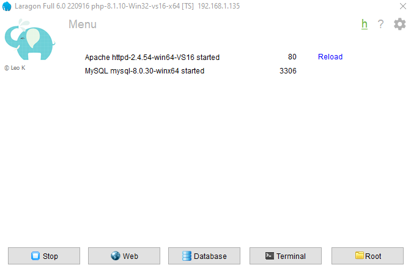
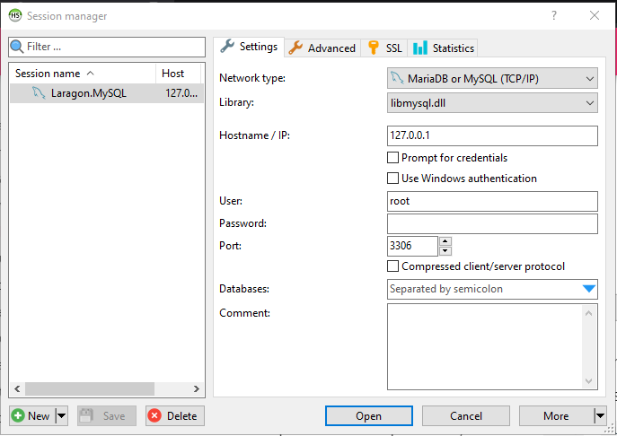
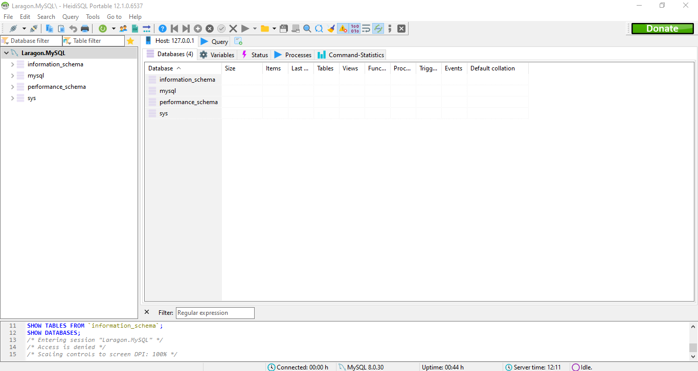

# Instalasi

## Instalasi Aplikasi Server

Seperti yang disinggung sebelumnya, untuk mempermudah proses installasi kita akan menggunakan aplikasi server Laragon. ikuti langkah-langkah berikut.

1. kunjungi halaman resmi Laragon pada [link berikut](https://laragon.org/download/)
2. pada bagian **Edition**, Klik **Download Laragon - Full (173 MB)** untuk mengunduh aplikasi laragon.
3. setelah proses download selesai, double klik pada file **laragon-wamp.exe** untuk melakukan installasi.
4. klik **Next** dan **Install** sampai selesai, lalu klik **Finish**
5. pada jendela aplikasi laragon yang terbuka, klik Start All untuk menjalankan server web dan database.
6. cukup klik tanda ++x++ untuk me-minimize aplikasi laragon.
   

## Mengunduh Aplikasi

Untuk mengunduh aplikasi ini lakukan langkah-langkah berikut:

1. kunjungi halaman release aplikasi pada [link berikut](https://github.com/masipnu/apg/releases/tag/v1.0)
2. unduh kode sumber dalam format ZIP dengan klik `Source code (zip)` pada bagian Assets.
3. Anda akan mendapatkan file `apg-1.0.zip`.
4. Ekstrak file tersebut pada direktori `C:\laragon\www`.
5. Anda akan mendapati direktori `apg-01`, silahkan rename menjadi `apg`.

## Instalasi Database

Karena Aplikasi ini bekerja menggunakan database maka kita perlu mengatur databasenya terlebih dahulu sebelum dijalankan.

1. Buka aplikasi laragon.
   
2. Klik `Database` untuk membuka aplikasi manajemen database Heidi SQL.
   
3. Biarkan bagian password (kosong), lalu klik **Open**.
   
4. Saat jendela heidi sql terbuka, klik menu `File` > `Run SQL file`, lalu arahkan ke file `apg.sql` yang berada didirektori `C:laragon\www\apg\database` dan klik **Open**. jika ada peringatan, klik **Yes**.
5. Selama tidak ada pesan `Error`, berarti database sudah tersedia.
6. Tekan tombol ++f5++ pada jendela Heidi SQL untuk me-refresh database, maka anda akan menemukan database `apg` lengkap dengan struktur tabel beserta contoh datanya.
7. Sekarang anda bisa menutup aplikasi Heidi SQl dan Me-Minimize Laragon.


## Konfigurasi Aplikasi

Setelah mengatur database, kita perlu melakukan konfigurasi database pada aplikasi APG.
Ikuti langkah-langkah berikut.

1. Buka file `config.php` pada direktori `C:\laragon\www\apg\library` dengan teks editor.
   Bisa Visual studio code atau Notepad.
2. Atur konfigurasi user dan password database pada baris berikut.
```php
<?php
$host = "localhost";
$user = "root";
$pass = "";
$db = "apg";

$con = mysqli_connect($host, $user, $pass, $db);

if (mysqli_connect_errno()) {
    echo "Koneksi gagal! : " . mysqli_connect_error();
}
?>
```
3. Karena pada user root tidak perlu memakai password, maka saya rubah `$user = "root";` menjadi `$user = "";`.
4. Cukup ini saja dan Aplikasi Manajemen Pegawai siap dijalankan.