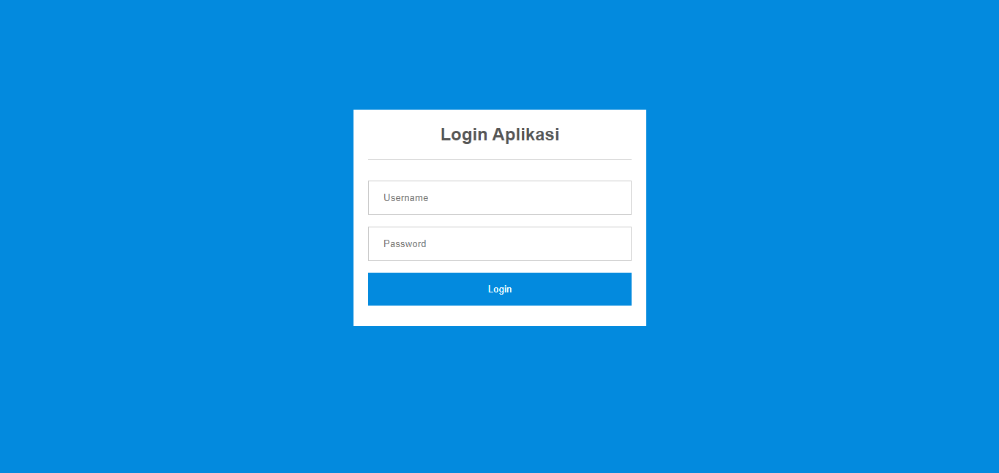
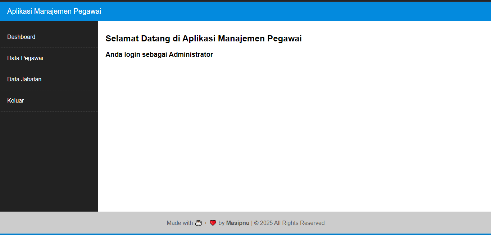

# Panduan Penggunaan

## Login dan Hak Akses

1. Untuk memulai aplikasi anda bisa membuka browser dan masukan alamat berikut [`http://localhost/apg`](http://localhost/apg).
2. Muncul tampilan halaman login.
   
3. Masukan Username `admin` dan password `admin` untuk login sebagai administrator, lalu klik **login**.
4. Selamat anda masuk ke halaman dashboard.
   
5. Untuk keluar anda bisa klik menu **keluar** pada sidebar.

## Dashboard Utama

## Manajemen Data Jabatan

### Menampilkan Data Jabatan

### Menambah Data Jabatan

### Memperbaharui Data Jabatan

### Menghapus Data Jabatan

## Manajemen Data Pegawai

### Menampilkan Data Pegawai

### Menambah Data Pegawai

### Memperbaharui Data Pegawai

### Menghapus Data Pegawai